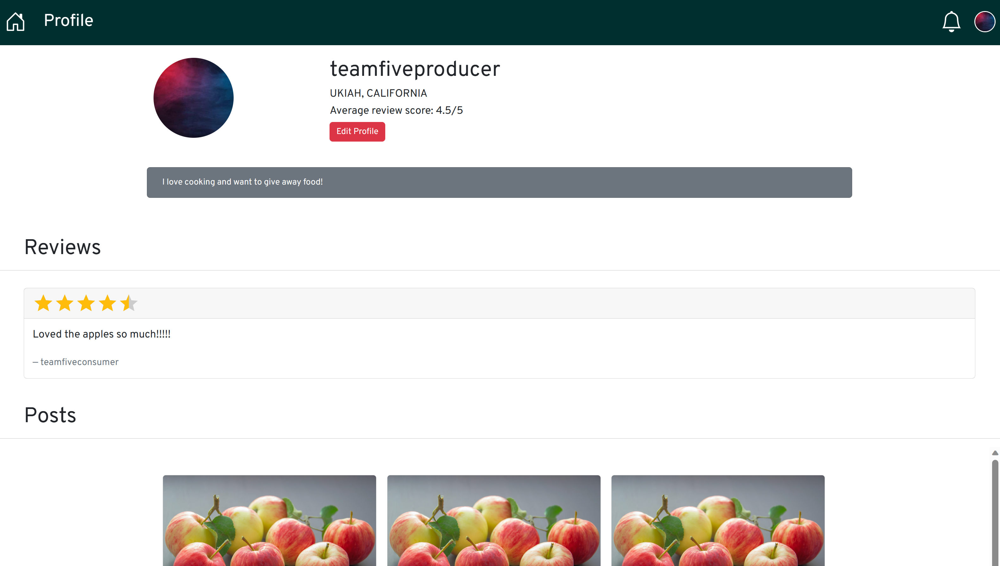
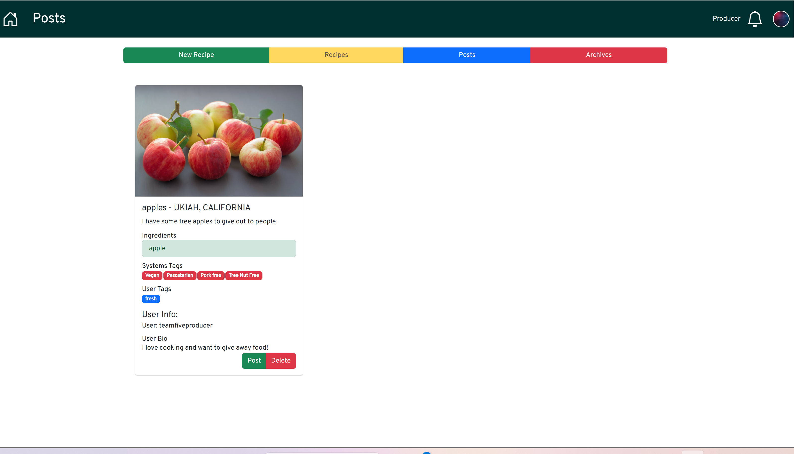

# HomeCooked

## Problem
With the COVID-19 pandemic having occured, there is still a level of aversion to meeting new people. As such, the sterotypical scenario of providing neighbors with food items has stagnated.

## Solution
WE decided to create HomeCooked as a way to help streamline the process of providing food that otherwise will not be used. Not only is this beneficial to both parties involved, but it alsp helps to prevent food waste. We allow for users to have a breath of options regarding how the service facilitates its service like distance based food matching to built in chat application <br/>

Attached below are example image of the application being run
# Login


# Signup


# Profile


# Dashboard


## data structures
### User:
- user_id               (key)
- user_fid              (str)
- user_uname            (str)
- user_address          (str)
- user_bio              (str)
- user_state            (str)
- user_city             (str)

### Event:
- event_id              (key)
- event_name            (str)
- event_desc            (str)
- event_date            (date)
- event_time            (time)
- event_location        (str)
- event_capacity        (int)
- event_host            (User)

### Recipe:
- recipe_id             (key)
- recipe_desc           (str)
- recipe_user           (User)
- recipe_name           (str)
- recipe_ingredients    (str)
- recipe_img            (str)

### Post:
- post_id               (key)
- post_title            (str)
- post_desc             (str)
- post_producer         (User)
- post_consumer         (User)
- post_created          (datetime)
- post_completed        (datetime)
- post_recipe           (Recipe)
- post_available        (boolean)

### Review:
- review_id             (key)
- review_desc           (str)
- review_user           (User)
- review_recipe         (recipe)
- review_rating         (int)
- review_post           (Post)

### Message:
- message_id            (key)
- message               (str)
- message_sender        (User)
- message_recipient     (User)
- message_sent          (datetime)

### DiscussionBoard:
- discussion_id         (key)
- discussion_desc       (str)
- discussion_sender     (User)
- discussion_event      (Event)
- discussion_data       (date)

## Urls:
```
/posts      gives a list of all posts
    /sort (GET) ?token=token or ?fid=fid    (GET)
        
        ?filter=open - show currently open posts authored by the user
        ?filter=producer-closed - show currently closed posts authored by the user
        ?filter=consumer-closed - show currently posts bought by the user
    
    /create ?token=<token> &title=<title> &desc=<desc> &recipe=<recipe>     (GET)
        create a new post
        required: token, recipe
    /update ?post-id=<post-id> &title=<title> &desc=<desc> &user-token=<consumer-token> &recipe-id=<recipe-id>
        update a post
        required: post-id
    /close ?token=<token> &post-id=<post-id>    (GET)
        close a post
    /delete ?token=<token> &post-id=<post-id>   (GET)
        delete a post
/users/
    /delete
    GET Request:
        [email|uname] - finds a user by email or username
        [id] - finds the coresponding user
        [city, state] - finds all users in the coresponding city and state
        TODO: [email|uname, pass] - confirm the email/uname pass works.
    POST Request:<br>
        [email, uname, pass, *address, *bio, *state, *city] - creates a new user (TODO: confirm email and uname aren't taken)
        [id|prev_email|prev_uname, email|uname|pass|address|bio|city|state] - updates an existing user
```
### format:
```
/path
    Request type
        [param_option1|param_option2, *optional_param] - description
```
